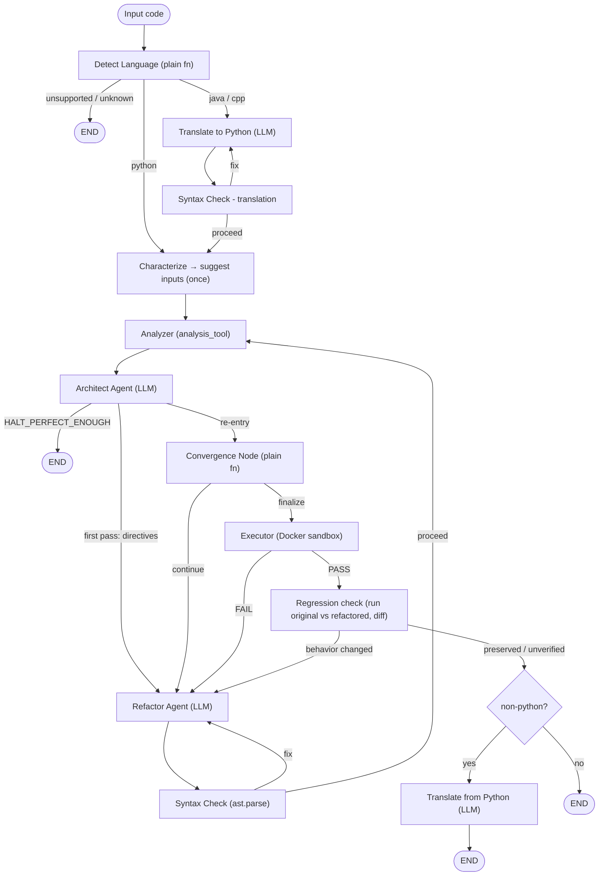

# 🛡️ CodeGuard

> Multi-agent Python code analysis and automated refactoring powered by LangGraph — with a lightweight black-box behavioral **regression check**.
> 

## What is CodeGuard?

CodeGuard is an agentic pipeline that takes raw code, detects its language, analyzes it for quality issues, automatically refactors it, and validates the result — all without human intervention. Python is analyzed directly; Java and C++ are translated to Python, processed, then translated back. Before refactoring, CodeGuard asks an LLM to **suggest a small suite of black-box inputs** for the original. After refactoring, it runs **both the original and the refactored code** on those same inputs and diffs their observable behavior (stdout + exception kind), so common behavior changes are **caught and flagged** before finalizing — a best-effort regression check, not a formal guarantee.

## Architecture

CodeGuard is built on **LangGraph**. The pipeline combines **three core LLM agents** (Translator, Architect, Refactor), one **LLM-assisted Characterizer**, and several **deterministic plain-function nodes** — including a **Convergence controller** (which replaced the old LLM comparator) and a **Regression check** — wired together as a directed graph with conditional edges. Refactoring is bounded by two caps: `max_iterations` (default 3, hard cap on refactor attempts) and `max_improvement_loops` (default 3, convergence loop cap).



### LLM agents + Characterizer

- **Translator Agent** — converts Java/C++ → Python before analysis, and Python → the original language after refactoring. Runs only for non-Python input. (`model1`, Groq, temp 0.2)
- **Architect Agent** — runs after every analyzer pass. Consumes the raw analyzer report, validates its output against a Pydantic schema (with retries), classifies findings (SOLID / Clean Code / Complexity) with severity + confidence, and emits a numbered, severity-sorted list of refactor directives. The global verdict is recomputed in code, never trusted from the model. (`model4`, OpenRouter, temp 0.2)
- **Refactor Agent** — rewrites code to satisfy the Architect's directives on the first pass, and on re-entry fixes only what the Syntax Check, Executor, or **Regression check** flagged (in that priority order). (`model1`, Groq, temp 0.1)
- **Characterizer (LLM-assisted)** — runs once at ingestion. Reads the Python original, decides the behavioral boundary (`stdio` vs `api`), and designs a coverage-minded input suite. The LLM only **suggests** the inputs; running both versions on them and comparing observations happens later in the Regression check and is fully deterministic. (`model2`, Groq, temp 0.1)

> A separate summary LLM (`report_llm`, `model3`, Groq, temp 0.2) is defined in `llms.py` for an optional final-report feature.
> 

### Plain-function nodes (no LLM)

- **Detect Language** — regex scoring with positive/negative signals to pick Python / Java / C++ or mark input unsupported.
- **Analyzer** — calls `analysis_tool` directly. The first run is captured as the baseline report.
- **Syntax Check** — `ast.parse()` on refactored (and separately on translated) code; loops back on failure.
- **Convergence Node** — scores each Architect report into a single weighted number and decides whether to keep refactoring or finalize. Replaces the old LLM comparator. (details below)
- **Executor** — calls `execute_code_tool` to run the code in a Docker container.
- **Regression check** — runs the **original** and the **refactored** code on the suggested inputs and diffs observable behavior (stdout + exception kind). `changed` → back to Refactor with the failing input as evidence; `preserved` / `unverified` → proceed (only a true `changed` verdict blocks).

### Tools & services

- `tools/analysis_tool.py` — single merged tool: time & space complexity, SOLID violations (SRP / OCP / LSP / ISP / DIP), and a clean-code index.
- `tools/execute_code_tool.py` — runs code in a Docker container, auto-installing third-party imports via pip before execution.
- `tools/convergence.py` — deterministic quality scoring: `score_report`, `compare_reports`, and the `ConvergenceController` stop logic.
- `tools/regression_check.py` — deterministic runner + `differential_check`: runs the original vs the refactored code on the same inputs and diffs observable behavior.

## Behavioral regression check

A refactor is *supposed* to rename, split, merge, add, and delete functions — so behavior cannot be checked per-function. CodeGuard checks it at the **boundary** instead, by running both versions **live** and diffing them (no stored snapshot, so nothing can go stale):

1. **Suggest inputs once** — before refactoring, the Characterizer (LLM) decides the behavioral boundary and proposes a small suite of black-box inputs. It only *suggests* inputs; it never judges correctness.
2. **Differential run** — after each refactor, feed the same inputs to **both the original and the refactored code** and compare their observations (stdout + exception kind) with a plain `==`. Internal renames/splits/additions are invisible by construction.

Two boundaries, one rule:

- **stdio** — programs that read stdin / print: compare stdout + exception kind on identical input.
- **api** — libraries: an LLM-written driver reads JSON args from stdin and calls the **public** functions; public names stay stable while internals churn freely.

Verdicts:

- **preserved** (`SAME`) — behavior matched on every checked case.
- **changed** (`DIFFERENT`) — a behavior change was found, reported with a counterexample.
- **unverified** (`INCONCLUSIVE`) — the original couldn't be run cleanly, or no cases could be generated, so nothing could be compared.

`unverified` is **flagged for visibility but never blocking** and never counted as a pass. Only a genuine `changed` verdict sends the code back to the Refactor agent. The check answers only *"same behavior?"*; *"better?"* is decided by the deterministic convergence loop below.

### Limitations

- It is a **smoke test, not a proof**: it compares stdout + exception kind on a small, LLM-suggested input set at the Python boundary only.
- It does **not** check non-stdout side effects (files, network, databases).
- For Java/C++, behavior is checked on the **Python translation**, not the final translated-back artifact.
- Rigorous equivalence (coverage-guided differential testing, side-effect capture) is **future work**.

## Quality Convergence (deterministic)

Instead of asking an LLM *"is this better?"*, CodeGuard scores quality deterministically. After each refactor pass the Analyzer and Architect re-evaluate the code; the **Convergence Node** then turns the latest Architect report into a single weighted score (severity- and complexity-weighted — lower is better, `0` = clean) and appends it to a history. The `ConvergenceController` then decides:

- **continue** → send the code back to the Refactor agent for another pass, or
- **finalize** → stop and hand off to the Executor, when the score reaches `0`, the per-pass gain drops below `min_gain` (default 0.05), or the loop hits `max_improvement_loops` (default 3).

This replaces the old LLM Comparator with a reproducible, explainable stop condition.

## Models

| Node | Type | Model (default) | Provider | Temp |
| --- | --- | --- | --- | --- |
| Detect Language | Plain fn | — | — | — |
| Translator | LLM | `model1` (openai/gpt-oss-120b) | Groq | 0.2 |
| Characterizer | LLM-assisted | `model2` (llama-3.3-70b-versatile) | Groq | 0.1 |
| Analyzer | Plain fn | — | — | — |
| Architect | LLM | `model4` (openai/gpt-oss-120b:free) | OpenRouter | 0.2 |
| Refactor | LLM | `model1` (openai/gpt-oss-120b) | Groq | 0.1 |
| Report summary | LLM | `model3` (openai/gpt-oss-20b) | Groq | 0.2 |
| Syntax Check | Plain fn | — | — | — |
| Convergence Node | Plain fn | — | — | — |
| Executor | Plain fn | — | — | — |
| Regression check | Plain fn | — | — | — |

<aside>
💡

The `openai/gpt-oss-*` models are open-weight models hosted on Groq, so `model1`–`model3` are Groq calls; only `model4` (Architect) goes through OpenRouter.

</aside>

## Project Structure

```
CodeGaurd/
├── app/
│   ├── agents/
│   │   ├── architect.py         # Architect Agent (LLM, OpenRouter)
│   │   ├── characterizer.py     # Characterizer - suggests black-box input cases (LLM-assisted, Groq)
│   │   ├── refactor.py          # Refactor Agent (LLM, Groq)
│   │   └── translator.py        # Translator Agent (LLM, Groq)
│   ├── graph/
│   │   ├── __init__.py          # exposes build_graph
│   │   ├── nodes.py             # plain-function nodes + convergence_node + regression_check_node
│   │   ├── routers.py           # conditional-edge routing (+ convergence_router, regression_router)
│   │   └── workflow.py          # StateGraph wiring (build_graph)
│   ├── helpers/
│   │   └── config.py            # pydantic-settings
│   ├── prompts/
│   │   ├── architect_prompt.py
│   │   ├── characterize_prompt.py
│   │   ├── refactor_prompt.py
│   │   └── translator_prompt.py
│   ├── schemas/
│   │   ├── characterization.py  # CharacterizationSpec (Pydantic) for the Characterizer
│   │   └── state.py             # AgentState TypedDict (+ quality_scores, test_inputs, test_mode, test_driver, regression_verdict, regression_report)
│   ├── services/
│   │   ├── complexity.py
│   │   ├── clean_code.py
│   │   ├── executer.py          # Docker sandbox runner
│   │   └── tests/               # calibration tests
│   ├── tools/
│   │   ├── analysis_tool.py
│   │   ├── execute_code_tool.py
│   │   ├── convergence.py       # score_report / compare_reports / ConvergenceController
│   │   └── regression_check.py  # differential_check + runner (run original vs refactored, diff)
│   ├── app.py                   # Streamlit web UI
│   ├── main.py                  # CLI entry point
│   ├── llms.py                  # LLM instantiation (Groq + OpenRouter)
│   ├── requirements.txt
│   └── .env.example
├── LICENSE
└── README.md
```

## Requirements

- Python 3.11+
- Docker Desktop (must be running)
- A Groq API key (free)
- An OpenRouter API key (free)
- A LangSmith API key (optional, for tracing)

## Installation

```bash
git clone https://github.com/AbdallahSabry7/CodeGaurd.git
cd CodeGaurd/app
python -m venv venv
# Windows
venv\Scripts\activate
# macOS / Linux
source venv/bin/activate
pip install -r requirements.txt
```

## Environment Setup

Copy the example env file (in `app/`) and fill in your keys:

```bash
cp .env.example .env
```

```bash
GROQ_API_KEY=
OPENROUTER_API_KEY=
LANGSMITH_API_KEY=
LANGCHAIN_TRACING_V2=true
LANGCHAIN_ENDPOINT=https://api.smith.langchain.com
LANGCHAIN_PROJECT=CodeGuard

# Groq models (required)
model1=openai/gpt-oss-120b         # Translator + Refactor
model2=llama-3.3-70b-versatile     # Characterizer
model3=openai/gpt-oss-20b          # Report summarizer (report_llm)

# OpenRouter model (Architect - set this; defaults to empty)
model4=openai/gpt-oss-120b:free
openai_api_base=https://openrouter.ai/api/v1

# Loop controls
max_iterations=3
max_improvement_loops=3
min_gain=0.05
```

## Usage

Run commands from inside the `app/` directory.

### Web UI (Streamlit)

```bash
streamlit run app.py
```

### CLI

```bash
python main.py --file path/to/your_code.py
cat your_code.py | python main.py --stdin
```

## License

Apache-2.0