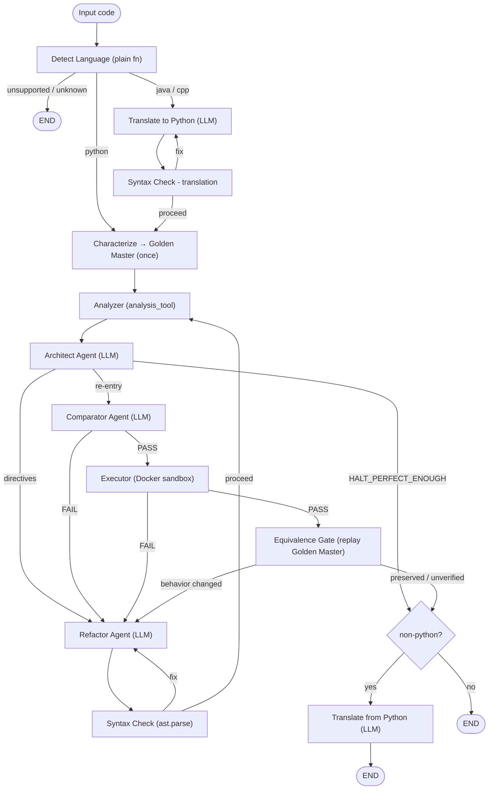

<aside>
🐋

This is the complete, up-to-date `README.md` for the repo, rendered below so the diagram, code blocks, and table display correctly. Copy it into your repo's `README.md`.

</aside>

# 🛡️ CodeGuard

> Multi-agent Python code analysis and automated refactoring powered by LangGraph — with black-box behavioral-equivalence verification.
> 

## What is CodeGuard?

CodeGuard is an agentic pipeline that takes raw code, detects its language, analyzes it for quality issues, automatically refactors it, and validates the result — all without human intervention. Python is analyzed directly; Java and C++ are translated to Python, processed, then translated back. Before refactoring, CodeGuard captures a **golden master** of the original's boundary behavior and replays it after every refactor, so a cleaner structure can never silently change what the program does.

## Architecture

CodeGuard is built on **LangGraph**. The pipeline is composed of **four LLM agents**, one **LLM-assisted Characterizer**, and several deterministic plain-function nodes wired together as a directed graph with conditional edges and a hard cap of `max_iterations` (default 3) refactor loops.



### LLM agents (four) + Characterizer

- **Translator Agent** — converts Java/C++ → Python before analysis, and Python → the original language after refactoring. Runs only for non-Python input.
- **Architect Agent** — runs after every analyzer pass. Consumes the raw analyzer report, validates its output against a Pydantic schema (with retries), classifies findings (SOLID / Clean Code / Complexity) with severity + confidence, and emits a numbered, severity-sorted list of refactor directives. The global verdict is recomputed in code, never trusted from the model.
- **Refactor Agent** — rewrites code to satisfy the Architect's directives on the first pass, and on re-entry fixes only what the Syntax Check, Comparator, Executor, or **Equivalence Gate** flagged (in that priority order).
- **Comparator Agent** — diffs the baseline Architect report against the latest one and returns PASS / FAIL.
- **Characterizer (LLM-assisted)** — runs once at ingestion. Reads the Python original, decides the behavioral boundary (`stdio` vs `api`), and designs a coverage-minded input suite. The LLM only picks the inputs; capturing and comparing observations is deterministic.

### Plain-function nodes (no LLM)

- **Detect Language** — regex scoring with positive/negative signals to pick Python / Java / C++ or mark input unsupported.
- **Analyzer** — calls `analysis_tool` directly. The first run is captured as the baseline report.
- **Syntax Check** — `ast.parse()` on refactored (and separately on translated) code; loops back on failure.
- **Executor** — calls `execute_code_tool` to run the code in a Docker container.
- **Equivalence Gate (Golden Master)** — replays the captured input suite against the refactored code and compares observations. `changed` → back to Refactor with the failing inputs as evidence; `preserved` / `unverified` → proceed (only a true `changed` verdict blocks).

### Tools & services

- `analysis_tool` — single merged tool: time & space complexity, SOLID violations (SRP / OCP / LSP / ISP / DIP), and a clean-code index.
- `execute_code_tool` — runs code in a Docker container, auto-installing third-party imports via pip before execution.
- `services/golden_master.py` — deterministic capture / replay / compare engine for behavioral equivalence.

## Behavioral Equivalence (Golden Master)

A refactor is *supposed* to rename, split, merge, add, and delete functions — so equivalence cannot be checked per-function. CodeGuard checks it at the **boundary** instead:

1. **Characterize once** — before any refactoring, run the original on a generated suite of inputs and record its observations (stdout + exception kind). That snapshot is the **golden master**.
2. **Replay** — after each refactor, feed the same inputs to the new code and compare to the golden master. Internal renames/splits/additions are invisible by construction.

Two boundaries, one rule:

- **stdio** — programs that read stdin / print: compare stdout + exception kind on identical input.
- **api** — libraries: an LLM-written driver reads JSON args from stdin and calls the **public** functions; public names stay stable while internals churn freely.

If the original can't be run or no cases can be generated, the result is **unverified** — flagged for visibility but **never blocking** and never counted as a pass. Only a genuine `changed` verdict sends the code back to the Refactor agent. Equivalence answers only *"same behavior?"*; *"better?"* stays with the Comparator/quality loop.

## Models

| **Node** | **Type** | **Model (default)** | **Provider** | **Temp** |
| --- | --- | --- | --- | --- |
| Detect Language | Plain fn | — | — | — |
| Translator | LLM | `model3` (llama-3.3-70b-versatile) | Groq | 0.2 |
| Characterizer | LLM-assisted | `model3` (llama-3.3-70b-versatile) | Groq | 0 |
| Analyzer | Plain fn | — | — | — |
| Architect | LLM | llama-4-scout-17b-16e-instruct | Groq | 0 |
| Refactor | LLM | `model1` (openrouter/owl-alpha) | OpenRouter | 0.2 |
| Syntax Check | Plain fn | — | — | — |
| Comparator | LLM | `model2` (llama-4-scout-17b-16e-instruct) | Groq | 0.1 |
| Executor | Plain fn | — | — | — |
| Equivalence Gate | Plain fn | — | — | — |

## Project Structure

```
CodeGuard/
├── app/
│   ├── agents/
│   │   ├── architect.py        # Architect Agent (LLM)
│   │   ├── characterizer.py    # Characterizer - builds the golden master (LLM-assisted)
│   │   ├── comparator.py       # Comparator Agent (LLM)
│   │   ├── refactor.py         # Refactor Agent (LLM)
│   │   └── translator.py       # Translator Agent (LLM)
│   ├── graph/
│   │   ├── __init__.py         # exposes build_graph
│   │   ├── nodes.py            # plain-function nodes + equivalence_node
│   │   ├── routers.py          # conditional-edge routing + equivalence_router
│   │   └── workflow.py         # StateGraph wiring (build_graph)
│   ├── helpers/
│   │   └── config.py           # pydantic-settings
│   ├── prompts/
│   │   ├── architect_prompt.py
│   │   ├── characterize_prompt.py
│   │   ├── comparator_prompt.py
│   │   ├── refactor_prompt.py
│   │   └── translator_prompt.py
│   ├── schemas/
│   │   └── state.py            # AgentState TypedDict (+ golden_master, behavior_diff, equivalence_report)
│   ├── services/
│   │   ├── golden_master.py    # capture / replay / compare engine
│   │   ├── complexity.py
│   │   ├── clean_code.py
│   │   ├── executer.py         # Docker sandbox runner
│   │   └── tests/              # calibration + test_golden_master.py
│   ├── tools/
│   │   ├── analysis_tool.py
│   │   └── execute_code_tool.py
│   ├── app.py                  # Streamlit web UI
│   ├── main.py                 # CLI entry point
│   ├── llms.py                 # LLM instantiation (Groq + OpenRouter)
│   ├── requirements.txt
│   └── .env.example
├── LICENSE
└── README.md
```

## Requirements

- Python 3.11+
- Docker Desktop (must be running)
- A Groq API key (free)
- An OpenRouter API key (free)
- A LangSmith API key (optional, for tracing)

## Installation

```bash
git clone https://github.com/AbdallahSabry7/CodeGuard.git
cd CodeGuard/app

python -m venv venv
# Windows
venv\Scripts\activate
# macOS / Linux
source venv/bin/activate

pip install -r requirements.txt
```

## Environment Setup

Copy the example env file (in `app/`) and fill in your keys:

```bash
cp .env.example .env
```

```bash
GROQ_API_KEY=
OPENROUTER_API_KEY=
LANGSMITH_API_KEY=
LANGCHAIN_TRACING_V2=true
LANGCHAIN_ENDPOINT=https://api.smith.langchain.com
LANGCHAIN_PROJECT=CodeGuard

model1=openrouter/owl-alpha
model2=meta-llama/llama-4-scout-17b-16e-instruct
model3=llama-3.3-70b-versatile
openai_api_base=https://openrouter.ai/api/v1

max_iterations=3
```

## Usage

Run commands from inside the `app/` directory.

### Web UI (Streamlit)

```bash
streamlit run app.py
```

### CLI

```bash
python main.py --file path/to/your_code.py
cat your_code.py | python main.py --stdin
```

## License

Apache-2.0